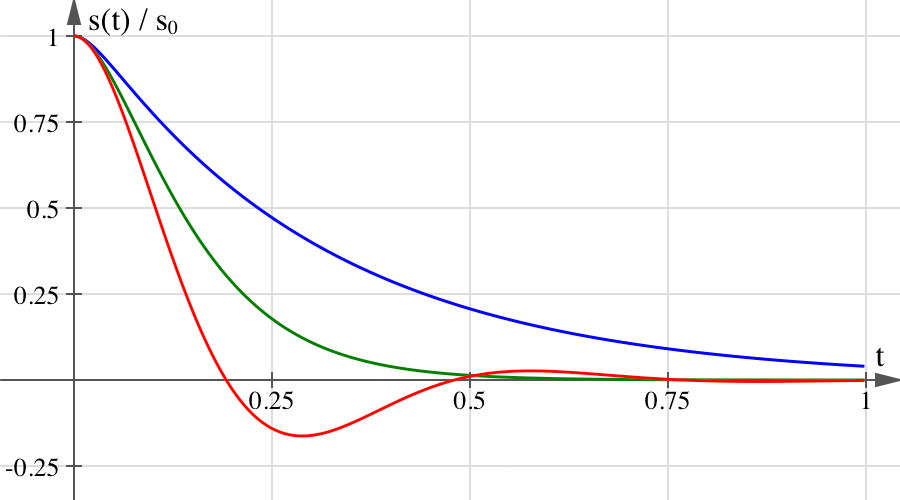
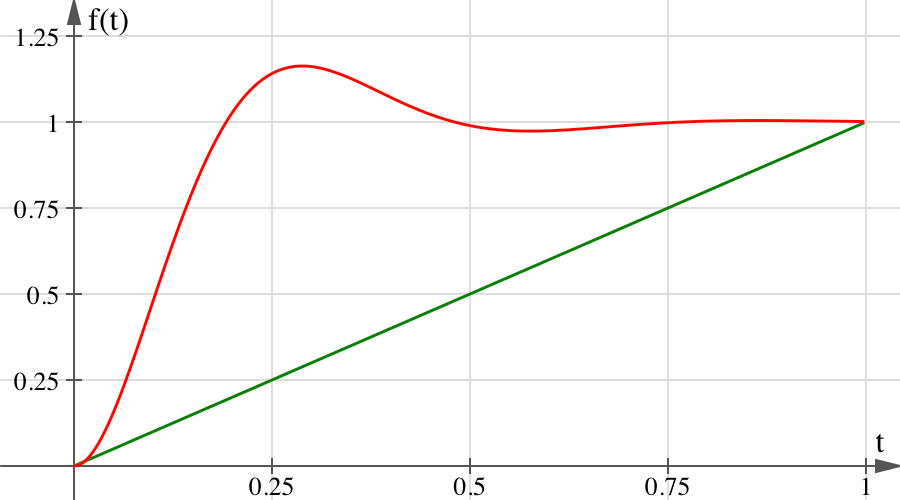

# Demystifying UIKit Spring Animations

Spring animations first became part of the public API back in iOS 7, but the damping-duration-interface from back then was very unnatural. It is still around today and we'll discuss why it is problematic in a bit. Things got a lot better with the addition of `UISpringTimingParameters` and `UIViewPropertyAnimator` in iOS 10, but it is still harder to craft animations that feel natural than it should be.

So what are spring animations, how do they work, and how can we craft animations that feel just right?


## The Physics Behind Spring Animations

Back in physics class in high school, we studied simple harmonic motions using the example of a mass on a spring. One can manually displace the mass from its equilibrium position, and the force exerted by the spring pulls the mass back towards equilibrium. In high school we studied this as an undamped system, i.e. one without friction, resulting in a sinusoidal motion of the form `s(t) = s_0·cos(ωt)`.

But chances are, when using a spring to drive an animation, that you want the animation to draw to a close sooner or later. This can be achieved by gradually withdrawing energy from the system as a result of damping. Viscous damping is a common form of damping where the damping force's magnitude is proportional to the velocity `s′(t)`, but is exerted in the opposite direction. By applying Newton's second law, balance of forces, we get the second-order differential equation `ks(t) + cs′(t) + ms″(t) ≡ 0` with mass `m > 0`, stiffness `k > 0`, and viscous damping coefficient `c ≥ 0`, which `s(t)` must satisfy. For arbitrary initial displacement `s(t = 0) = s_0` and velocity `s′(t = 0) = v_0`, the differential equation has a unique solution whose form depends on the concrete values of the spring parameters:

- For `c < 2sqrt(km)` we have an underdamped system. The system oscillates about its equilibrium position in a decaying sinusoidal motion, regardless of the initial velocity. The oscillation is what makes it feel "springy".
- For `c > 2sqrt(km)` the system is overdamped. Here the damping force is strong enough to prevent the system from oscillating. With sufficiently large initial velocity the target value can be overshot though.
- For `c = 2sqrt(km)` the system is critically damped. This is where the damping force is just strong enough to prevent oscillation. Critically damped systems converge towards equilibrium the fastest of all three cases.


Figure: The equations of motion for an underdamped (red), critically damped (green), and overdamped (blue) spring with unit displacement at `t = 0`.

At the time of writing overdamped springs are not supported by UIKit. Besides, I don't know where you'd ever want to use an overdamped spring animation — if you need something bouncy, you'd go with an underdamped spring; if you don't want it to bounce, you'd typically want the animation to settle as quickly as possible and use a critically damped spring.

For more information on the concrete forms of `s(t)`, please refer to the following [Grapher file][Grapher File].


## Designing Spring Animations

With a trained eye you can see that with parameters `αm`, `αk` and `αc`, the differential equation from above has the same solution `s(t)` for any `α > 0`. This means that a spring's characteristics are uniquely determined by just two parameters: We could assume a unit mass and tweak only the spring's stiffness and its damping coefficient.

But I highly doubt that anyone can make sense of concrete values for these parameters without plotting the corresponding equation of motion. In the 2018 WWDC Session [Designing Fluid Interfaces][Designing Fluid Interfaces], Apple suggested using a different set of parameters that are much more design-friendly: damping ratio and frequency response. The damping ratio is the ratio of the actual damping coefficient to the critical damping coefficient. A damping ratio of `0` therefore describes an undamped system, while a damping ratio of `1` describes a critically damped system. The frequency response is defined as the duration of one period in the undamped system. This property essentially determines how fast the animation will feel, but it should not be confused with the duration of the entire animation: In theory spring animations never really come to a rest — they are simply assumed to have ended when the amplitude becomes small enough.

Unfortunately, UIKit does not currently allow us to construct a spring animation using these parameters. While we can create spring timing parameters using some damping ratio, we cannot specify the frequency response. In fact, there is an infinite number of springs with a given damping ratio that all behave differently! The spring's underlying physical properties are only determined when we create a `UIViewPropertyAnimator` with a fixed duration, but that duration is the duration of the entire animation, the duration until a small enough amplitude is reached — a value not very meaningful for design work either. The whole point of using spring animations is having an animation that feels natural, with the spring parameters you choose — not a spring animation that is, say, critically damped and whose displacement from equilibrium becomes negligible (whatever that may mean...) after precisely `0.75` seconds. The latter will likely feel a little off.

If you instead create spring timing parameters with a mass, damping coefficient and stiffness, the duration you pass to a `UIViewPropertyAnimator` is ignored, as it should, because the three parameters alone uniquely identify the spring's equation of movement, and the animation should run until the amplitude becomes negligible.

So if you want to craft a spring animation that feels natural, don't explicitly specify the animation's duration. Instead, create timing parameters that completely specify the spring's underlying parameters and let the animator derive its duration from those parameters. The following snippet shows how to convert damping coefficient and frequency response to mass, stiffness, and viscous damping coefficient:

```swift
extension UISpringTimingParameters {
    public convenience init(dampingRatio: CGFloat, frequencyResponse: CGFloat) {
        precondition(dampingRatio >= 0)
        precondition(frequencyResponse > 0)

        let mass = 1 as CGFloat
        let stiffness = pow(2 * .pi / frequencyResponse, 2) * mass
        let damping = 4 * .pi * dampingRatio * mass / frequencyResponse

        self.init(mass: mass, stiffness: stiffness, damping: damping, initialVelocity: .zero)
    }
}
```


## Springs in an Animation Context

Animations interpolate between their from- and to-values using a so-called timing function `f(t)` according to the equation `value(t) = start + f(t)·(end - start)`. This is done regardless of how big or small the distance between the from- and to-value is. For a linear animation the timing function would have the form `f(t) = t / duration`, for example. But we can use just about any `f(t)`, including one motivated by the motion of a spring, as long as `f(0) = 0` and `f(duration) = 1`, i.e. the animations starts at the from-value and somehow transitions to the to-value.


Figure: An underdamped spring timing function (red) and a linear timing function (green).

This hints at the key difference between physical springs and animations already: the equation of motion for a spring deals with absolute units, say meters. Timing functions, on the other hand, are normalized to the unit interval with their codomain being unitless, indicating the fraction of the animation that has completed. The spring's velocity is still the derivative of its displacement, but in an animation context this, too, becomes a relative quantity: the fraction of the animation that is completed per second. Therefore a relative initial velocity of `1` corresponds to an absolute initial velocity that covers the entire animation distance in one second.

Note that evaluating the normalized spring timing function and using its value to interpolate the from- and to-value yields the same result as evaluating the spring's equation of motion with appropriately scaled initial position and velocity. Let's say you use a pan gesture recognizer to let the user move some object and want to start a spring animation to the object's destination when the user lifts his finger, using the touch's velocity as the initial velocity for the spring. We know that the current position corresponds to a fraction complete of `0` and the target position to a fraction complete of `1`, thus we can calculate the relative initial velocity as `v_rel = v_abs / (target - current)`.

You may wonder what happens if we are already at the target value. We'd divide by zero, resulting in an infinite relative initial velocity, regardless of the absolute initial velocity! The problem is that when the from- and to-value are identical, any inter- or extrapolated value will be, too, and we can't possibly compute a reasonable relative initial velocity. In order to preserve the absolute initial velocity, we must first displace the current value a tiny bit so that we can map the values to the unit interval bijectively, allowing us to compute a reasonable relative initial velocity. Doing so yields a relative velocity of surprisingly high magnitude. Keep in mind though that this velocity has to be interpreted relative to the distance between the animation's endpoints, which we chose to be very small. Therefore the resolved absolute velocity of the animation matches the provided absolute initial velocity.


Figure: A critically damped spring timing function with high relative velocity.


## Initial Velocity as a Vector

The initial velocity of a spring is a scalar value, not a vector. However, `UISpringTimingParameters` makes us to specify the initial velocity as a vector. What is going on here?

The reason we get to specify a vector is to make it easier to animate two-dimensional properties like a view's position, where the initial velocity might be different along the `x` and `y` axes. This really just creates two spring animations under the hood, one for the `x` position and one for the `y` position, with potentially different initial velocities and a shared completion handler.

When animating one-dimensional properties, the `y` component of the initial velocity is completely ignored. The documentation states that for 1D-properties, the vector's magnitude is used as the animation's initial velocity. This is plain wrong. Besides, this would prevent us from having negative initial velocities.

I have found a view's position (`center`) to be the only property where an initial `y` velocity has an effect. When animating a view's size, UIKit does not distinguish between width and height and uses the `x` component for both. This is also the case when animating a view's transform, even if it is only a translation.


## Additional Resources

I wrote a little demo app that lets you play around with spring parameters and animations driven by those. The sample code also shows how to properly calculate the relative initial velocity, including the aforementioned displacement that is necessary when already at the target value. You can find said project [on GitHub][GitHub Repository].


[GitHub Repository]: https://github.com/jenox/UIKit-Playground/tree/master/01-Demystifying-UIKit-Spring-Animations/ "Demystifying UIKit Spring Animations"
[Grapher File]: https://github.com/jenox/UIKit-Playground/tree/master/01-Demystifying-UIKit-Spring-Animations/Resources/DampedHarmonicSpring.gcx "DampedHarmonicSpring.gcx"
[Designing Fluid Interfaces]: https://developer.apple.com/videos/play/wwdc2018/803/
